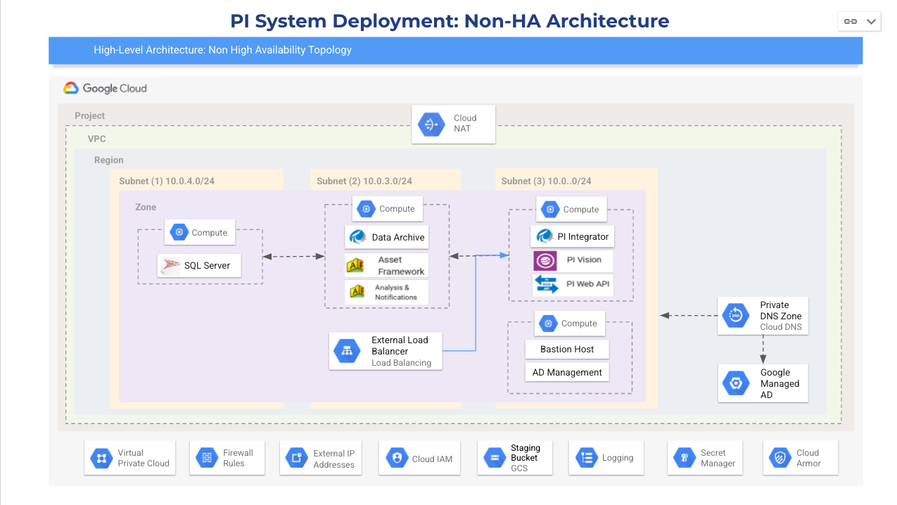
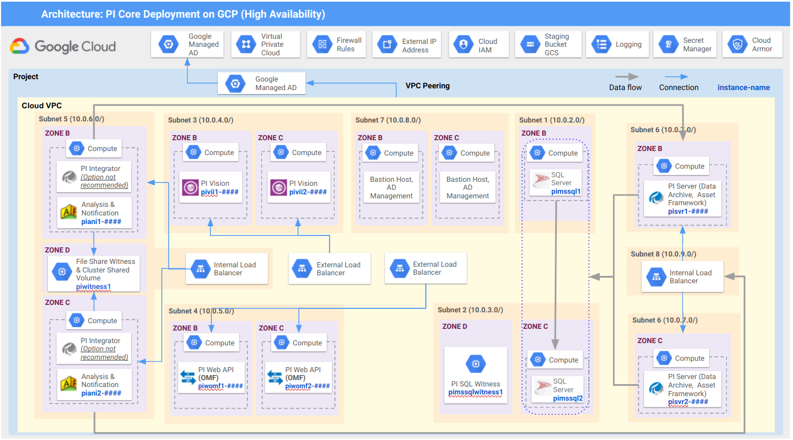

## Note

> Small to medium environemnt with High Availabilty is not available at this time, updates expected later this month - April 2021.

## Description

GCP deployment scripts for OSIsoft PI Core have been created by Quantiphi Inc. in partnership with Google and OSIsoft to automate installation and configuration of OSIsoft PI software components and Google Cloud Computing Services. Two scenarios are supported, small to medium PI Core system with or without high availability.

This guide provides step-by-step instructions for deploying a new installation of OSIsoft PI Core on GCP environment. GCP deployment scripts for PI Core is intended for use by new and existing OSIsoft customers to support quick and iterative testing and prototyping. OSIsoft PI Core on GCP scripts provides an easy way to deploy PI software repeatedly and reliably to the Google Cloud.

>  Note: 
>  * The deployment samples are meant for testing and prototyping purposes only, and not intended for use within a production environment
>  * The deployment scripts are not an officially supported Google or OSIsoft product
  
The scripts provided in this repository leverage Terraform and Windows Powershell for new installations of the following components of PI Core:
*  Microsoft SQL Server 
*  PI Data Archive (DA)
*  PI Asset Framework (AF)
*  PI Asset Framework Analytics and Notifications
*  PI Integrator for Business Intelligence supporting Google Pub/Sub, Google Cloud Storage and Google BigQuery
*  PI Web API (including OMF end-point)
*  PI Vision

Google Services to support PI Core include:
* Google Cloud Storage
* Google Compute Engine
* Google Cloud DNS
* Google Cloud VPC
* Google Managed Active Directory
* Google Cloud Load Balancing and Cloud Armor

## Deployment Architecture for OSIsoft PI Core on GCP

GCP deployment scripts for PI Core cater to two scenarios:
1. example small to medium PI Core environment, also referred to as Non-HA
2. example small to medium PI Core environment with the addition of high availability, also referred to as HA

> Note: in the interest of minimizing initial cost, minimal compute instances, storage type and storage have been configured. For example, the two scenarios are derived from OSIsoft topologies of the same name and to meet the maximum performance envelope would require additional memory, disk and a different disk type. Google and OSIsoft recommend consulting your respective architecture experts for guidance on the appropriate architecture, compute, storage type and storage configuration to meet your development and testing requirements. 

The Google Compute Engine instances are configured using N2D Series, powered by AMD EPYC Rome CPU platform. For more information on Google Cloud and AMD, please refer to [this link](https://cloud.google.com/blog/products/compute/announcing-the-n2d-vm-family-based-on-amd)

### Small to medium PI Core environment (non-HA)



Four compute engines
* SQL Server
* PI Data Archive, PI Asset Framework including Analysis and Notifications
* PI Vision, PI Web API (omf endpoint), PI Integrator for Business Intelligence
* Baston host accessible using Google Identity Aware Proxy

### Small to medium PI Core environment with High Availability (HA)




Google and OSIsoft features are utilized to add high availability to the small to medium PI Core deployment. Additional components include
Google Cloud
* multiple availability zones
* Load balancer
Microsoft
* Windows Clusters
* SQL Server Always On availability groups
PI Core
* PI Collective for the PI Data Archive
* High availabilty for PI Asset Framework, Analysis and Notifications.
* Multiple instances of PI Vision and PI Web API

Microsoft Clusters support SQL Server, PI Asset Framework Analysis and Notifications Services.
Cloud Load Balancing supports Microsoft Clusters, Asset Framework, PI Vision and PI Web API.

#### High Availability means additional resources and allocation requirements!

While the HA architecture provides improved resiliency against outages and failure it also requires more GCP resources than a non-HA configuration. 
In addition, if changes are made to the scripts, consider the placement of components to maintain high availability, including for example allocation of resources to zones.

**Ensure this is evaluated during the planning process i.e. before deployment.**

## Prerequisites for Deployment

### Software Requirements

*   A Google Cloud project with billing enabled. For more information on creating a project, refer to the official [Google Cloud Platform documentation](https://cloud.google.com/resource-manager/docs/creating-managing-projects)
*   PI Components Installation kit. Download the necessary software mentioned below through the [OSIsoft Customer Portal.](https://customers.osisoft.com/s/)

         1. PI Server installation kit -  PI-Server_2018-SP3-Patch-1_.exe
         2. PI Vision installation kit - PI-Vision_2019-Patch-1_.exe
         3. PI Web installation kit - PI-Web-API-2019-SP1_1.13.0.6518_.exe
         4. PI Integrator installation kit - OSIsoft.PIIntegratorBA_2020_ADV_1000_2.3.0.425_.exe (optional)
         5. Temporary PI license    
 
*  Terraform with version >= 0.13. To install Terraform, head to the [download manager](https://www.terraform.io/downloads.html)

### Google Cloud Services

Before starting installation, it is recommended that users familiarize themselves with the GCP resources provisioned to manage this deployment. Refer to the links below for a deeper expanation:

*  [**Google Compute Engine**](https://cloud.google.com/compute/docs) - Computing infrastructure in predefined or custom machine sizes on GCP. Compute Engine offers predefined virtual machine configurations for every need and are used to host PI Core software
*  [**Cloud Load Balancing**](https://cloud.google.com/load-balancing/docs) - Distributes load-balanced compute resources in single or multiple regions (closer to users) meets high availability requirements. It can put your resources behind a single anycast IP and scale your Compute resources up or down for your applications
*  [**Cloud NAT**](https://cloud.google.com/nat/docs/overview) - Cloud NAT (network address translation) allows Google’s VM instances without external IP addresses and private Kubernetes Engine clusters to send outbound packets to the internet and receive any corresponding established inbound response packets
*  [**Google Managed Active Directory**](https://cloud.google.com/managed-microsoft-ad/docs) - Managed Service for Microsoft Active Directory (AD) is a highly available, hardened GCP service running actual Microsoft AD that allows you to manage authentication and authorization for AD-dependent workloads, automate AD server maintenance and security configuration, and connect any on-premises AD domain to the cloud. *For this engagement, it is assumed that customers ensure their AD is on Google Cloud, and not on-premise*
*  [**Cloud VPC**](https://cloud.google.com/vpc/docs/vpc) - Provides connectivity for VM instances, offers native Internal TCP/UDP Load Balancing and proxy systems for Internal HTTP(S) Load Balancing, connects to on-premises networks using Cloud VPN tunnels and Cloud Interconnect attachments and distributes traffic from Google Cloud external load balancers to backends
*  [**Cloud Armor**](https://cloud.google.com/armor/docs) - Protects infrastructure and applications from distributed denial-of-service (DDoS) attacks
*  [**Cloud DNS**](https://cloud.google.com/dns/docs) - USed to publish your domain names by using Google's infrastructure for production-quality, high-volume DNS services
*  [**Google Cloud Storage (GCS)**](https://cloud.google.com/storage/docs) - You can use GCS buckets for a range of scenarios including serving website content, storing data for archival and disaster recovery, or distributing large data objects to users via direct download

## Deployment Procedure

### Before you Deploy

#### 1. Download the code on your local machine

Click Clone or Download and then Download Zip to download the contents of this GitHub repository, and select the target location on your local machine

OR use the following git command: 

         git clone


#### 2. Creating Cloud Storage Buckets on GCP


*  Users must first create **two** Cloud Storage (GCS) buckets. The name of these buckets will be passed during deployment:

The first one will be used to store PI server installation executables mentiond in the "Software Requirements" section.
The folder structure for this bucket will be as follows:

    bucket  -> pivision - this will contain the .exe for PI Vision - PI-Vision_2019-Patch-1_.exe
            -> piserver  - this folder will containe the .exe for PI Server and the temporary license file - PI-Server_2018-SP3-Patch-1_.exe
            -> piserver -> pivision-db-files - This folder contains all the "SQL scripts" and ".bat" files needed for installation of the PI Vision DB
            -> piweb - this will contain the .exe for the PI Web API (and OMF) - PI-Web-API-2019-SP1_1.13.0.6518_.exe
            -> integrator - this will contain the .exe for the PI Integrator - OSIsoft.PIIntegratorBA_2020_ADV_1000_2.3.0.425_.exe

>  Note: The folder names are case sensitive


*  The second GCS bucket passed to the remote Terraform backend (as shown in later stages of this section).


#### 3. Terraform

1.  Once your code has been downloaded or cloned as mentioned in the first step, head over to the **terraform** directory of the repo
2.  Within the directory, edit the **"provider.tf"** file. Within that file, change the following for the **backend block**:
         a. Enter the name of the GCS bucket created in step above to store the **.tfstate** file
         b.((Optional) Enter a prefix
         c. Edit the credential file name that is present inside the Terraform directory
3. Within the terraform directory, add the Service Account JSON Key (credential file) with the following permissions:

            [
            "roles/compute.admin",
            "roles/secretmanager.admin",
            "roles/resourcemanager.projectIamAdmin",
            "roles/iam.serviceAccountAdmin",
            "roles/managedidentities.admin",
            "roles/managedidentities.domainAdmin",
            "roles/compute.loadBalancerAdmin",
            "roles/compute.storageAdmin",
            "roles/iam.serviceAccountUser",
            "roles/resourcemanager.projectMover",
            "roles/storage.admin"
            ]


#### 4. Update the gcloud SDK on your local machine

Google Cloud SDK can be installed through [this documentation.](https://cloud.google.com/sdk/docs/install) 

Update gcloud SDK configurations on your local machines along with the alpha and beta componets. Use the following commands to set the GCP project:

       [gcloud config set project [project name]] //refers to the name of the project where the scripts are to be be deployed
       [gcloud components install alpha]
       [gcloud components install beta]
       [gcloud auth activate-service-account [service account email] --key-file=KEY_FILE]


#### 5. Enable APIs

Ensure the APIs listed below are enabled at least 10 minutes before the Terraform deployment. These are required when enabling billing for service accounts.

                    [
                    "compute.googleapis.com",
                    "storage-component.googleapis.com",
                    "iam.googleapis.com",
                    "iamcredentials.googleapis.com",
                    "managedidentities.googleapis.com",
                    "secretmanager.googleapis.com",
                    "dns.googleapis.com",
                    "cloudresourcemanager.googleapis.com"
                    ]
                    
#### 6. Network

Ensure that **no existing network** is be present withing RFC-1918 CIDR ranges. Users can verify this by heading to their GCP console, into "VPC Network" under the "Networking" category under the IP Ranges Column. For more information, please visit this [documentation link for Google Managed AD](https://cloud.google.com/managed-microsoft-ad/docs/selecting-ip-address-ranges#using_a_24_range_size). 

 
### Steps to Deploy the OSISoft PI Core on GCP

Once all the steps in the previous section are complete, the Terraform deployment can begin

* Ensure you in the **terrafom** directory of your repo, where the **readme.txt** is present for reference. This location also has  the **main.tf** file.
* Run the commands below for deployment


        terrafom init
        terraform plan
        terraform apply

*  During **terraform plan** and **terraform apply** steps, Terraform will ask for values for the variables mentioned below (left). Please fill/edit in the values for each variable as per your preference (right):


            1. architecture       = Non-HA / HA
            2. region             = "us-east1" [You can select any region that is supported by GCP]
            3. project_id         = "osi-pi-test-2" [Your project ID]
            4. ad-cidr            = "172.16.0.0/20" [RFC 1918 valid ranges supported]
            5. compute-multi-cidr = "10.0.0.0/20" [RFC 1918 valid ranges supported]
            6. ad-dn              = "osipi.com"
            7. storage            = "osi-pi-test-2" [Your bucket name consisting of the powershell executable files]
            8. creds              = "creds.json" [Your credential file name within the the terraform directory. See Step 3 in the "Before you Deploy" section]
            9. tf_sa              = "gcp-devops@appspot.gserviceaccount.com"
            10. epsec             = **Option not implemented** 10000 / 20000 [events per second. For non-HA deployments, 10,000 events per second is used]
            11. valid_domain      = Yes / No
            12. ssl-dn            = "osi.qdatalabs.com" [If you have selected "Yes" for point 11, add your valid public domain name and Google will manage the certificate. If "No", use the mentioned dummy domain. If you have a separate certificate (self-signed or otherwise), please refer to "Post Deployment Steps"]


* Once solution is deployed, verify if the installation is complete by checking success files flags inside the GCS bucket for your executables (See Step 2 in "Before you Deploy"). In this bucket you will see a set of 6 text files called success files/flags that indicate the completion of the installation process:
    * sql_success.txt
    * piserver_success.txt
    * integrator_success.txt
    * vision_success.txt
    * omf_success.txt
    * db_success.txt

## Post Deployment Steps

Now that you have successfully deployed your PI Core software, you will have to test them to ensure they are running correctly. Before you begin running your PI Core components, follow the pre-requisites and configuration changes below:

### 1. (Optional) If Users Have Their Own Certificate

This step is only applicable to users who do not immediately have a valid domain but would prefer to have their own certificate over a Google Managed one. 

**Pre-requisite:**
While creating the certificate make sure to give the **Common Name** (e.g. the IP of the Load Balancer or Server FQDN etc.)
 
**Configuration:**
Below are the steps to upload the certificate on the GCP Cloud Console 
* In the GCP Cloud Console, open the **Load Balancing page** from the navigation menu
* Select the Load Balancer with the following name: **url-map-pivii** and click on **Edit** to change the configurations  
* Select the **frontend configuration** and click the edit icon on the right side of the page 
* Within that certificate dropdown , click on **Create a new Certificate**
* In the Public Key certificate section, upload the cert.pem from your local machine
* In the Private Key certificate section, upload the key.pem from your local machine
* Click on **Create**
* Finally, select **Update** to update the changes


### 2. Security configuration for Cloud Armor and PI Vision

#### Cloud Armor

This step is required to ensure the appropriate users are listed in the Cloud Armor rules so that the load balancer accepts the corresponding IP addresses. Change the configuration using the following steps:

1. In your GCP Cloud Console, go to the Cloud Armor page from the navigation menu
2. Select the following policy: **policy-pivii** 
3. To edit the rules there, select the rule that has the following description: **“first rule”** and click on the edit icon on the right of the table 
4. Under the **Match** section within that page, add your Public IP Address besides the already existing IP. Ensure they are separated by “,” 
5. Update the rule

**B) PI Vision Authentication**

If using basic authentication with PI Vision, complete the following steps

1. Enable basic authentication feature

1.1 Manual

Refer to the [following documentation](https://docs.microsoft.com/en-us/iis/configuration/system.webserver/security/authentication/basicauthentication) provided by Microsoft to undergo steps to enable basic authentication.

1.2 PowerShell

Run PowerShell as an administrator
Run the following command: 
```
Enable-WindowsOptionalFeature -Online -FeatureName IIS-BasicAuthentication
```

2. Update IIS configuration for PI VIsion

Follow the steps present in this official PI Vision document: [Enable Basic Authentication: PI Vision 2019](https://livelibrary.osisoft.com/LiveLibrary/content/en/vision-v3/GUID-9CF76AC8-BBB9-4E1C-A77C-63373901E64A#addHistory=true&filename=GUID-4B33BAFA-A923-4550-B3DC-CAD83E3C0587.xml&docid=GUID-9CF76AC8-BBB9-4E1C-A77C-63373901E64A&inner_id=&tid=&query=&scope=&resource=&toc=false&eventType=lcContent.loadDocGUID-9CF76AC8-BBB9-4E1C-A77C-63373901E64A)

3. Go to your machine's Internet Information Services (IIS) Manager and click on the Default Website in the Connections panel. Restart this connection (on the right side of the window)

## Destroy the deployment

* To destroy the infrastucture, run the command before on Terraform: 

        terrafom destroy

>  Note: destroy will not delete lables set on the project. You will have to manually delete those labels by navigating to Project Settings->Labels
>  Note: After destroying the code via terraform destroy, manual deletion of instance template (C drive) disks are required through console.

**This is not an officially supported Google or OSIsoft product.**

 


