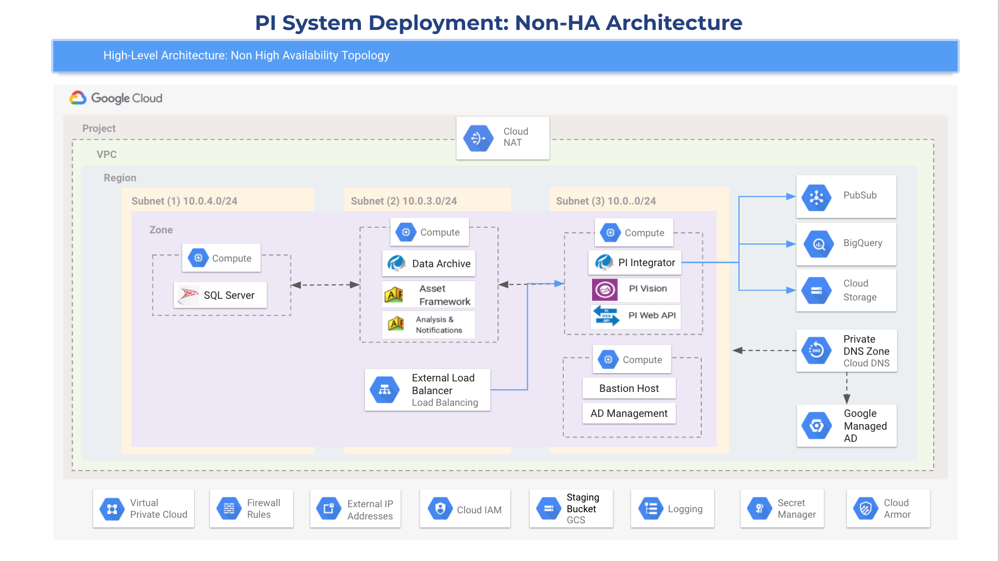

## Table of Contents

- [Overview](#overview)
- [Deployment Architecture for GCP deployment scripts for AVEVA PI Server](#deployment-architecture-for-gcp-deployment-scripts-for-aveva-pi-server)
   *  [Small to medium AVEVA PI Server environment (non-HA)](#small-to-medium-sized-aveva-pi-server-non-high-availability-or-non-ha)
   *  [Small to medium AVEVA PI Server environment with High Availability (HA)](#small-to-medium-sized-aveva-pi-server-high-availability-or-ha)
- [Prerequisites for Deployment](#prerequisites-for-deployment)
   * [Software Requirements](#software-requirements)
   * [Google Cloud Services](#google-cloud-services)
- [Deployment Procedure](#deployment-procedure)
   * [Before you Deploy](#before-you-deploy)
     + [1. Download the code on your local machine](#1-download-the-code-on-your-local-machine)
      + [2. Create Cloud Storage Buckets on GCP](#2-create-cloud-storage-buckets-on-gcp)
      + [3. Terraform](#3-terraform)
     + [4. Update the gcloud SDK on your local machine](#4-update-the-gcloud-sdk-on-your-local-machine)
     + [5. Enable APIs](#5-enable-apis)
      + [6. Network](#6-network)
   * [Steps to Deploy the AVEVA PI Server on GCP](#steps-to-deploy-the-aveva-pi-server-on-gcp)
- [Post Deployment Steps](#post-deployment-steps)
   * [1. (Optional) If users have a certificate of their own](#1-optional-if-users-have-a-certificate-of-their-own)
   * [2. Security configuration for Cloud Armor and PI Vision](#2-security-configuration-for-cloud-armor-and-pi-vision)
      + [Cloud Armor](#cloud-armor)
      + [PI Vision Authentication](#pi-vision-authentication)
- [Destroy the GCP Environment](#destroy-the-gcp-environment)

## Overview

GCP deployment scripts for - OSIsoft, now a part of AVEVA - AVEVA PI Server have been created by Quantiphi Inc. in partnership with Google and AVEVA to automate the installation and the configuration of AVEVA software components on Google Cloud Computing Services. The deployment scripts support two network topologies:

   * Small to Medium sized AVEVA PI Server system **without** High Availability (or Non-HA)
   * Small to Medium sized AVEVA PI Server system **with** High Availability (or HA)

This guide instructs users on deploying a new installation of AVEVA PI Server in a Google Cloud Platform (GCP) environment. **GCP deployment scripts for AVEVA PI Server** are intended for use by new and existing AVEVA customers to support quick and iterative testing and prototyping. **GCP deployment scripts for AVEVA PI Server** provide an easy way to deploy PI software repeatedly and reliably to Google Cloud.

> Note:
> * **GCP deployment scripts for AVEVA PI Server are** 
>    + Meant for testing and prototyping purposes only, and not intended for use within a production environment
>    + Not an officially supported product by Google or AVEVA.
 
The scripts provided in this repository leverage Terraform and Windows Powershell for new installations of the following AVEVA software components:
* Microsoft SQL Server
* PI Data Archive (DA)
* PI Asset Framework (AF)
* PI Asset Framework Analytics and Notifications
* PI Integrator for Business Intelligence supporting Google Pub/Sub, Google Cloud Storage, and Google BigQuery
* PI Web API (including OMF end-point)
* PI Vision

Google Services to support the AVEVA PI Server installations include:
* Google Cloud Storage
* Google Compute Engine
* Google Cloud DNS
* Google Cloud VPC
* Google Managed Active Directory
* Google Cloud Load Balancing and Cloud Armor

## Deployment Architecture for GCP deployment scripts for AVEVA PI Server

GCP deployment scripts for AVEVA PI Server cater to two scenarios:

   1. Small to Medium sized AVEVA PI Server system **without** High Availability (or Non-HA)
   2. Small to Medium sized AVEVA PI Server system **with** High Availability (or HA)

> Recommendation: 
> * The deployment scenarios are based upon topologies designed by AVEVA, however to minimize initial deployment cost the scripts do not configure resources at the scale defined in the topologies.
> * Google and AVEVA recommend consulting your respective architecture experts to review the architecture, along with required compute, memory, storage type, and storage configuration to meet your development and testing requirements.

The Google Compute Engine instances are configured using N2D Series, powered by AMD EPYC Rome CPU platform. For more information on Google Cloud and AMD, please refer to [this link](https://cloud.google.com/blog/products/compute/announcing-the-n2d-vm-family-based-on-amd)

### Small to Medium sized AVEVA PI Server (Non-High Availability or Non-HA)

The Non-HA topolgy and architecture limits deployment of the AVEVA PI Server services to **four Compute Engine instances and a single External Load Balancer**. The Compute Engine instances deployed contain the following AVEVA PI Server elements:
* 1 x SQL Server
* 1 x PI Data Archive, PI Asset Framework including Analysis and Notifications
* 1 x PI Vision, PI Web API (OMF endpoint), PI Integrator for Business Intelligence
* 1 x Baston host accessible using Google Identity Aware Proxy

### Small to Medium sized AVEVA PI Server (High Availability or HA)

Google and AVEVA features are utilized to add high availability to the small to medium sized AVEVA PI Server deployments. The HA topology deploys a total of **14 Compute Engine Instances, 2 External Load Balancers and 2 Internal Load Balancers.** Excluding the installation of double the AVEVA PI Server services mentioned in **Small to Medium sized AVEVA PI Server system (Non-High Availability or Non-HA)** section, the HA architecture also includes the following additional components:
* Google Cloud
    * Multiple availability zones
* Microsoft
    * Windows Clusters
    * SQL Server Always On availability groups
* AVEVA PI Server
    * PI Collective for the PI Data Archive
    * High availability for PI Asset Framework, Analysis and Notifications
    * Multiple instances of PI Vision and PI Web API

Microsoft Clusters support **SQL Server, PI Asset Framework Analysis and Notifications Services.**

Cloud Load Balancing supports **Microsoft Clusters, Asset Framework, PI Vision, and PI Web API.**

> **High Availability means additional resources and allocation requirements!**
> * While the HA architecture provides improved resiliency against outages and failure, it also requires more GCP resources than a non-HA configuration.
> * In addition, if changes are made to the scripts, consider the placement of components to maintain high availability, including - for example - allocation of resources to zones
> * **Ensure this is evaluated during the planning process before the deployment of the scripts.**

## Prerequisites for Deployment

### Software Requirements

* A Google Cloud project with enabled billing. For more information on creating a project, refer to the official [Google Cloud Platform documentation](https://cloud.google.com/resource-manager/docs/creating-managing-projects)
* AVEVA PI Server Components Installation kit. Download the necessary software mentioned below through the [OSIsoft Customer Portal.](https://customers.osisoft.com/s/)

     1. PI Server installation kit - PI-Server_2018-SP3-Patch-1_.exe
     2. PI Vision installation kit - PI-Vision_2019-Patch-1_.exe
     3. PI Web installation kit - PI-Web-API -2019-SP1_1.13.0.6518_.exe
     4. PI Integrator installation kit - OSIsoft.PIIntegratorBA_2020_ADV_1000_2.3.0.425_.exe (optional) *
     5. Temporary / Production PI license
 
* Terraform versions >= 0.13. To install Terraform, head to the [download manager](https://www.terraform.io/downloads.html) on the official website
* PI Integrator for Business Analytics does not support high availability for the backend SQL server that hosts the PIIntegratorDB, PIIntegratorLogs, and PIIntegratorStats databases in production environments.

### Google Cloud Services

Prior to the installation, it is recommended that users familiarize themselves with the GCP resources provisioned to manage this deployment. The links to the official Google Cloud documentation for each of the services used are provided below:

* [**Google Compute Engine**](https://cloud.google.com/compute/docs) - Computing infrastructure in predefined or custom machine sizes on GCP. Compute Engine offers predefined virtual machine configurations for every need and are used to host AVEVA PI Server software
* [**Cloud Load Balancing**](https://cloud.google.com/load-balancing/docs) - Distributes load-balanced compute resources in single region or in multiple regions, and meets high availability requirements. It can put your resources behind a single anycast IP and scale your Cloud Compute resources up or down for your applications
* [**Cloud NAT**](https://cloud.google.com/nat/docs/overview) - Cloud NAT (network address translation) allows Google’s VM instances without external IP addresses and private Kubernetes Engine clusters to send outbound packets to the internet and receive any corresponding established inbound response packets
* [**Google Managed Active Directory**](https://cloud.google.com/managed-microsoft-ad/docs) - Managed Service for Microsoft Active Directory (AD) is a highly available, hardened GCP service running actual Microsoft AD that allows you to manage authentication and authorization for AD-dependent workloads, automate AD server maintenance and security configuration, and connect any on-premises AD domain to the cloud. *The deployment scripts are created with the assumption that a Customer's AD is on Google Cloud, and not on-premise*
* [**Cloud VPC**](https://cloud.google.com/vpc/docs/vpc) - Provides connectivity for VM instances, offers native Internal TCP/UDP Load Balancing and proxy systems for Internal HTTP(S) Load Balancing, connects to on-premises networks using Cloud VPN tunnels and Cloud Interconnect attachments, and distributes traffic from Google Cloud external load balancers to backend services
* [**Cloud Armor**](https://cloud.google.com/armor/docs) - Protects infrastructure and applications from distributed denial-of-service (DDoS) attacks
* [**Cloud DNS**](https://cloud.google.com/dns/docs) - USed to publish your domain names by using Google's infrastructure for production-quality, high-volume DNS services
* [**Google Cloud Storage (GCS)**](https://cloud.google.com/storage/docs) - You can use GCS buckets for a range of scenarios including serving website content, storing data for archival and disaster recovery, or distributing large data objects to users via direct download

## Deployment Procedure

### Before you Deploy

#### 1. Download the code on your local machine

Click **Clone** or **Download**, and then **Download Zip** to download the contents of this GitHub repository, and select the target location on your local machine.

OR use the following git command:

     git clone

#### 2. Create Cloud Storage Buckets on GCP

Users must first create **two** Cloud Storage (GCS) buckets. The name of these buckets will be passed during deployment:

* The first one will be used to store PI server installation executables mentioned in the "Software Requirements" section.
* The folder structure for this bucket will be as follows:
    *  bucket --> 
        * pivision: Contains the .exe for PI Vision - **PI-Vision_2019-Patch-1_.exe**
        * piserver: Contains the .exe for PI Server and the temporary license file - **PI-Server_2018-SP3-Patch-1_.exe**
        * piserver --> pivision-db-files: Contains all the SQL scripts and .bat files needed to install the PI Vision DB
        * piserver --> License: Contains the temporary / production PI license file
        * piweb: Contains the .exe for the PI Web API (and OMF) - **PI-Web-API -2019-SP1_1.13.0.6518_.exe**
        * integrator: Contains the .exe for the PI Integrator - **OSIsoft.PIIntegratorBA_2020_ADV_1000_2.3.0.425_.exe**

> Note: The folder names are case sensitive

The second GCS bucket passed to the remote Terraform backend (as shown in later stages of this section).

#### 3. Terraform

* Once the code has been downloaded or cloned as mentioned in Step 1, head over to the **terraform** directory of the repository
* Within the directory, edit the **"provider.tf"** file. Within that file, change the following for the **backend block**:
     * Enter the name of the GCS bucket created in the step above to store the **.tfstate** file
     * ((Optional) Enter a prefix
     * Edit the credential file name that is present inside the Terraform directory
* Within the terraform directory, add the Service Account JSON Key (credential file) with the following permissions:

      [
      "roles/compute.admin",
      "roles/secretmanager.admin",
      "roles/resourcemanager.projectIamAdmin",
      "roles/iam.serviceAccountAdmin",
      "roles/managedidentities.admin",
      "roles/managedidentities.domainAdmin",
      "roles/compute.loadBalancerAdmin",
      "roles/compute.storageAdmin",
      "roles/iam.serviceAccountUser",
      "roles/resourcemanager.projectMover",
      "roles/storage.admin"
      ]

#### 4. Update the gcloud SDK on your local machine

* Google Cloud SDK can be installed using [this documentation.](https://cloud.google.com/sdk/docs/install)
* Update the gcloud SDK configuration on your local machines along with the alpha and beta components. Use the following commands to set the GCP project:

      [gcloud config set project [project name]] //refers to the name of the project where the scripts are to be deployed
      [gcloud components install alpha]
      [gcloud components install beta]
      [gcloud auth activate-service-account [service account email] --key-file=KEY_FILE]

#### 5. Enable APIs

* Ensure the APIs listed below are enabled **at least 10 minutes before** the Terraform deployment. These are required when enabling billing for service accounts.

          [
          "compute.googleapis.com",
          "storage-component.googleapis.com",
          "iam.googleapis.com",
          "iamcredentials.googleapis.com",
          "managedidentities.googleapis.com",
          "secretmanager.googleapis.com",
          "dns.googleapis.com",
          "cloudresourcemanager.googleapis.com"
          ]
          
#### 6. Network

* Ensure that **no existing network** is present within RFC-1918 CIDR ranges. Users can verify this by heading to their GCP console, into "VPC Network" under the "Networking" category under the IP Ranges Column. 
* For more information, please visit this [documentation link for Google Managed AD](https://cloud.google.com/managed-microsoft-ad/docs/selecting-ip-address-ranges#using_a_24_range_size).

 
### Steps to Deploy the AVEVA PI Server on GCP

Once all the steps in the previous section are complete, the Terraform deployment can begin

* Locate the terraform.tfvars file under **terraform** folder and fill in the parameters below. Please fill/edit in the values for each variable as per your requirement. Provided above are examples for the values. Please replace with your own parameters:

      1. architecture       = "HA" [Please enter HA or Non-HA]
      2. region             = "us-east1" [You can select any region that is supported by GCP]
      3. project_id         = "osi-pi-test-2" [Your project ID]
      4. ad-cidr            = "172.16.0.0/20" [RFC 1918 valid ranges supported]
      5. compute-multi-cidr = "10.0.0.0/20" [RFC 1918 valid ranges supported]
      6. ad-dn              = "test.com" [Please enter Domain Name]
      7. storage            = "storage-bucket" [Your bucket name consisting of the powershell executable files]
      8. creds              = "creds.json" [Your credential file name within the terraform directory. See Step 3 in the "Before you Deploy" section]
      9. tf_sa              = "gcp-devops@appspot.gserviceaccount.com" [Enter email id of the service account use to deploy terraform with proper permission]
      10. epsec             = **Option not yet implemented. Currently does nothing**  "20000" [events per second. For non-HA deployments, 10,000 events per second is used]
      11. valid_domain      = Yes / No [Enter 'Yes' if you have valid public domain, enter 'No' if you don't]
      12. ssl-dn            = "osi.qdatalabs.com" [If you have selected "Yes" for point 11, add your valid public domain name and Google will manage the certificate. If "No", use the mentioned dummy domain. If you have a separate certificate (self-signed or otherwise), please refer to "Post Deployment Steps"]
      13. zones             = ["us-east1-b","us-east1-c","us-east1-d"] [Please enter region for deployment supported by google cloud. Enter as an array]
      14. OS		      = "[Enter Windows, Linux, or MacOS depending on which OS you're using to deploy the script]"

* If you didn't create / fill in the terraform.tfvars file from the previous step, during **terraform plan** and **terraform apply** steps, Terraform will ask for values for the variables mentioned above and you will need to enter them manually. 

* Ensure you are in the **terraform** directory of your repo, where the **readme.txt** is present for reference. This location also has the **main.tf** file.
* Run the commands below for deployment

    * terrafom init
    * terraform plan
    * terraform apply
 

* Once the solution is deployed, verify if the installation is complete by checking success files flags inside the GCS bucket for your executables (**See Step 2 in "Before you Deploy"**). In this bucket you will see a set of 6 text files called success files/flags that indicate the completion of the installation process:
  * af_success.txt
  * an_success.txt
  * buff_success.txt
  * collective_success.txt
  * complete.txt
  * db_success.txt
  * intdb_success.txt
  * omf_success.txt
  * pivision_success.txt
  * success_sql2.txt

## Post Deployment Steps

Now that you have successfully deployed your AVEVA PI Server software, the scripts must be tested to ensure they are running as anticipated. Before you begin running your AVEVA PI Server components, follow the pre-requisites and configuration changes below:

### 1. (Optional) If users have a certificate of their own

* This step is only applicable to users who do not immediately have a valid domain but would prefer to have a certificate of their own over a Google Managed one.

**Pre-requisite:**
* While creating the certificate make sure to give the **Common Name** (e.g. the IP of the Load Balancer or Server FQDN etc.)
 
**Configuration:**
* Below are the steps to upload the certificate on the GCP Cloud Console
    * In the GCP Cloud Console, open the **Load Balancing page** from the navigation menu
    * Select the Load Balancer with the following name: **url-map-pivii** and click on **Edit** to change the configurations 
    * Select the **frontend configuration** and click the edit icon on the right side of the page
    * Within that certificate dropdown, click on **Create a new Certificate**
    * In the Public Key certificate section, upload the cert.pem from your local machine
    * In the Private Key certificate section, upload the key.pem from your local machine
    * Click on **Create**
    * Finally, select **Update** to update the changes

### 2. Security configuration for Cloud Armor and PI Vision

#### Cloud Armor

* This step is required to ensure the appropriate users are listed in the Cloud Armor rules so that the load balancer accepts the corresponding IP addresses. Change the configuration using the following steps:

    * In your GCP Cloud Console, go to the Cloud Armor page from the navigation menu
    * Select the following policy: **policy-pivii**
    * To edit the rules there, select the rule that has the following description: **first rule** and click on the edit icon on the right of the table
    * Under the **Match** section within that page, add your Public IP Address besides the already existing IP. Ensure they are separated by “,”
    * Update the rule

### 3. Known Issue

#### OMF PI Web API Buffering

* For HA deployment, there's a chance buffering on the PI Web API machine is not working properly

    * Restart the PI Web API Service from Windows Services

#### PI Vision Authentication

If a user is leveraging basic authentication with PI Vision, complete the following steps:

**1. Enable basic authentication feature**

   1.1 Manual

   Refer to the [following documentation](https://docs.microsoft.com/en-us/iis/configuration/system.webserver/security/authentication/basicauthentication) provided by Microsoft to undergo steps to enable basic authentication.

   1.2 PowerShell

   Run PowerShell as an administrator
   Run the following command:

      
      Enable-WindowsOptionalFeature -Online -FeatureName IIS-BasicAuthentication
      

**2. Update IIS configuration for PI VIsion**

Follow the steps present in this official PI Vision document: [Enable Basic Authentication: PI Vision 2019](https://docs.osisoft.com/bundle/pi-vision/page/enable-basic-authentication.html)

**3. Go to your machine's Internet Information Services (IIS) Manager and click on the **Default Website** in the **Connections** panel. Restart this connection (on the right side of the window)**

## Destroy the GCP Environment

* Only for HA - delete the front end configuration before proceeding with the next step

    gcloud compute forwarding-rules delete i --region=region --quiet

    Replace i with "fwd-ani-1", "fwd-ani-2", and "fwd-ani-3" and region with the region of the deployment (ex: gcloud compute forwarding-rules delete fwd-ani-1 --region=us-east1 --quiet)

* To destroy the infrastructure, run the command before on Terraform:

    terraform destroy

> Note: destroy will not delete **labels** set on the project. Users must manually delete those labels by navigating to Project Settings --> Labels

